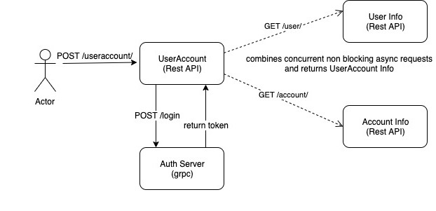

## Description

This project demonstrates restful/grpc communication between different backends in Sync/Async way.

Http server and client is implemented using finagle library.

Finagle helps to construct high-concurrency non blocking light weight servers and client library supports retry, timeouts, circuit breaker etc.

High level flow is provided below.

